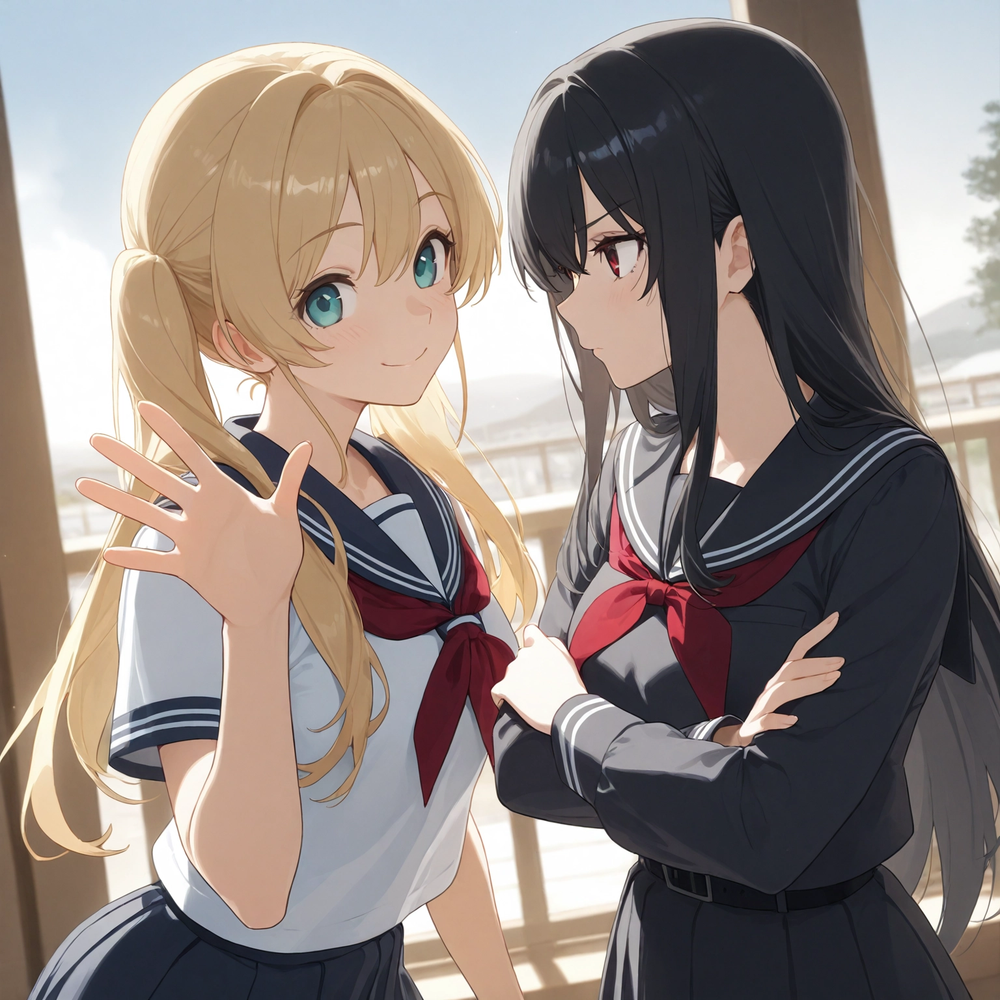

<h1 align="center">Multiple Characters</h1>
<p align="center">
<b>by. Haoming</b><br>
<i>2025 Jan.</i>
</p>

## Introduction
With older checkpoints *(mainly **SD1** and early **SDXL** models)*, it was difficult to generate multiple different concepts *(**eg.** characters)* within the same image, without causing some sort of "feature mixing" such as color bleed.

This issue can be solved by using the following Extension, targeting each region separately with different conditioning *(**ie.** prompt)*.

> See [Example](#example)

## Requirements
- For **Forge** Webui, install the following Extension:
    - [sd-forge-couple](https://github.com/Haoming02/sd-forge-couple)
- For **Automatic1111** Webui, install the following Extension:
    - [sd-webui-regional-prompter](https://github.com/hako-mikan/sd-webui-regional-prompter)

> [!TIP]
> Learn how to install [Extensions](../README.md#extensions)

## How to Use
- refer to the **README** of each Extension

## Example

- Generate the following prompt using the exact same `checkpoint` and `seed`:

    ```
    masterpiece, best quality, high quality, screencap, anime screenshot,
    2girls, blonde twintails, cyan eyes, white serafuku, standing, waving, looking at viewer, smile,
    2girls, black long hair, red eyes, dark school uniform, crossed arms, looking away
    ```

<table>
    <tr align="center">
        <td><b>w/o Extension</b></td>
        <td><b>Forge Couple</b></td>
    </tr>
    <tr>
        <td></td>
        <td></td>
    </tr>
</table>

<p align="center"><sub>
<i>(Infotext is included in the images)</i>
</sub></p>
