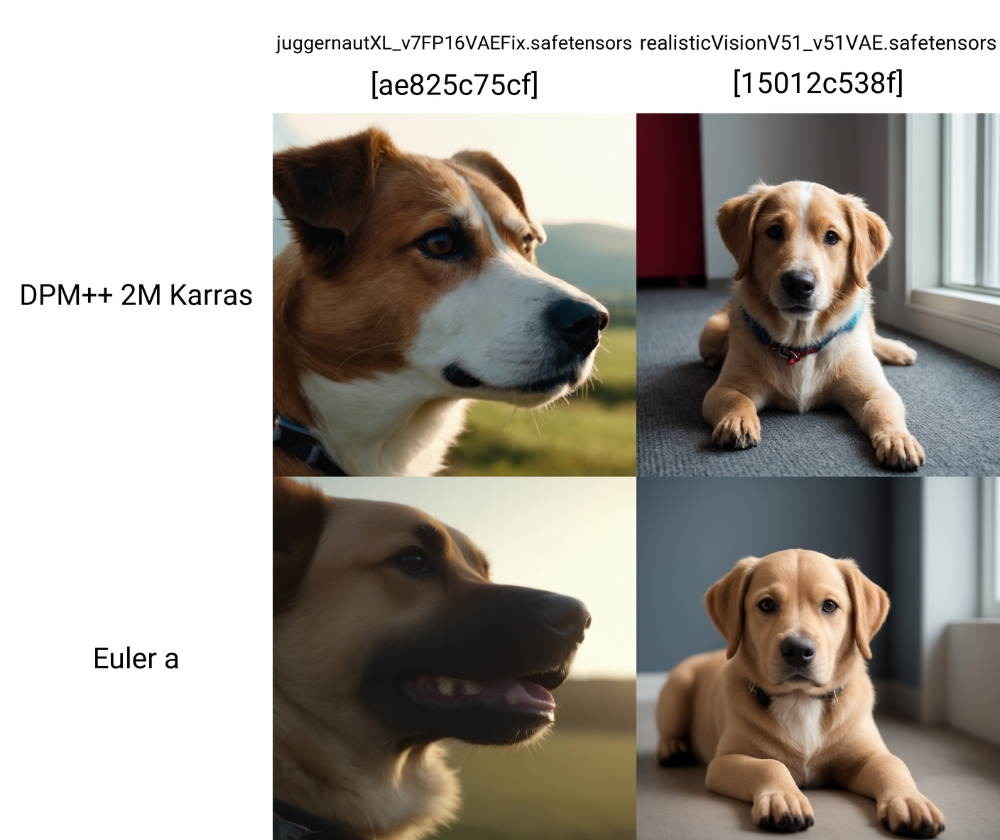

<h1 align="center">X/Y/Z Plot</h1>

<b>by. Haoming</b>

## Introduction
**X/Y/Z Plot** is an extremely useful tool for **comparing** and **evaluating** models, prompts, or other settings. You can use it to create a grid of images generated from different configurations, then quickly determine what performs better at a glance. You can find it in the **Script** dropdown at the bottom of the **txt2img** and **img2img** tabs.

## How to Use
- **X axis** will generate variations horizontally
- **Y axis** will generate variations vertically
- **Z axis** will generate another XY Grid separately

For each axis, you can choose a type as the variable in the left field, then enter the values to cycle through in the right field, each separated by comma. Some of the types *(**eg.** `Checkpoint name`)* also come with a `📒` button, which when clicked will populate the field with all possible values.

### Prompt S/R
> *Some further explanation for this type*

#### How it Works
It first scans through the prompt to **search** for the first string in the field, then generates images with said string **replaced** by each of the other strings in the field.

#### Use Case - Training Evaluation
If you train a LoRA for multiple epochs, the filenames may come in the format of `{filename}-{epoch count}`. To easily compare the epochs, add the LoRA syntax to the prompt *(**eg.** `<lora:name-000008:0.8>`)*, then you can use `Prompt S/R`, with the **X** axis being `08, 12, 16` for the epoch number; and the **Y** axis being `0.8, 0.6, 0.4` for the weights. The script will then generate a 3x3 grid with LoRAs from different epochs at different weights.

> [!TIP]
> To have commas within a string in `Prompt S/R`, surround the string in quotes  
> *(**eg.** `"long hair, blond hair", "short hair, black hair"`)*

## Example
- **Prompt:** `a 4k cinematic photo of a dog`
- **X axis:** `Checkpoint name`
- **Y axis:** `Sampler`

