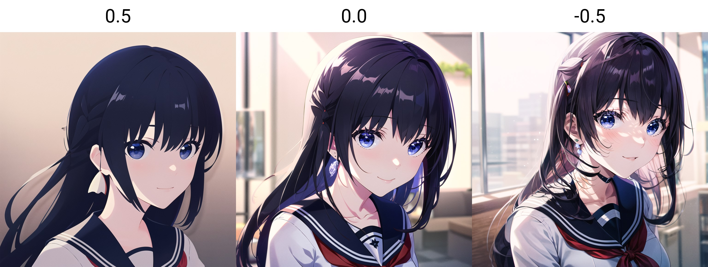
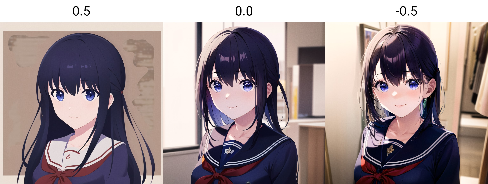

# Extra Details

There is a LoRA called [Minimalist Anime Style](https://civitai.com/models/24833/minimalist-anime-style) on CivitAI, 
which when used can generate some simple stylistic results. 
But someone on Reddit found out that, when used with **negative** LoRA strength *(still in **positive** prompt)*,
it can instead generate incredibly detailed results.

**Note:** If you put the stregnth too high, the result is sometimes distorted however.

## Example Images:
The following images feature [Mana](https://civitai.com/models/18659/nagase-mana-idoly-pride) in uniform, using the above LoRA with strength from `0.5` to `-0.5`

