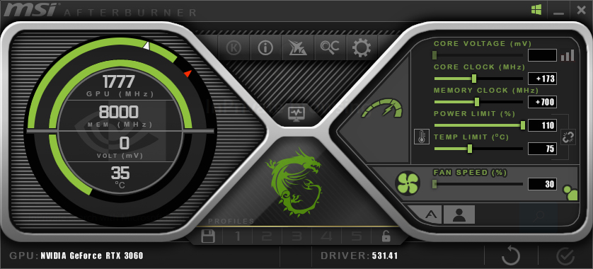

<h1 align="center">Overclocking</h1>

<i>by. Haoming 2023/05/11</i>

<h3 align="center" style="color:red">--- Warning ---</h2>
<h4 align="center" style="color:red">This can <b>damage</b> your GPU if done incorrectly!</h4>

> MSI Ampere Afterburner skin by Drerex Design

You can download [MSI Afterburner](https://www.msi.com/Landing/afterburner/graphics-cards) to overclock your GPU and in turn speed up generation.

> Despite the name, it works on GPUs from other brands as well.

- Adjust the sliders to push for higher performance
  - Normally, you should be able to push ~100 for Core Clock and ~500 for Memory Clock
  - **Do some research** and look for others' recommended settings first
- Clicking the Cog icon allows you to adjust other settings as well as changing the skin
- Clicking the Windows icon to automatically apply the overclocking on the next boot
  - **IMPORTANT:** If you enable this while having a faulty setting, your computer may become **unusable** as it tries to apply the settings then automatically shut down right away!
  - Always do testings and benchmarks first before turning this on!
- The actual improvements you can get depend on the silicon lottery

<h4 align="center" style="color:red">Again, this can and will <b>damage</b> your GPU if not done correctly!</h4>
<h5 align="center" style="color:red">I'm not responsible for whatever happens to your GPU</h5>