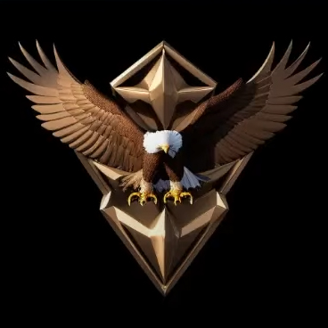

<h1 align="center">Random Tips & Tricks</h1>

<i>by. Haoming 2023/04/26</i>

## Insane Upscale
> Learn how to install [Extensions](../README.md#extensions)

When you use `Hires. fix` or `img2img` to upscale an image, you may encounter **CUDA Out of Memory Error** if the resolution is too high.
You can solve this by installing this extension:
- `MultiDiffusion with Tiled VAE (multidiffusion-upscaler-for-automatic1111)` *([Github](https://github.com/pkuliyi2015/multidiffusion-upscaler-for-automatic1111))*

Then, turn on **Tiled VAE** and adjust the settings if needed. 

*I was able to upscale a `1024x1024` image to `2048x2048` with only **8GB** of VRAM.*

## Extra Details
There is a LoRA called [Minimalist Anime Style](https://civitai.com/models/24833/minimalist-anime-style) on CivitAI, 
which when used can generate some simple stylistic results. 
But someone on Reddit found out that, when used with **negative** LoRA strength *(still in **positive** prompt)*,
it can instead generate incredibly detailed results.

**Note:** If you put the stregnth too negative, the result may become distorted however.

### Example Images:
The following images feature [Mana](https://civitai.com/models/18659/nagase-mana-idoly-pride) in uniform, using the above LoRA with strength from `0.5` to `-0.5`

## Logo Creations
You can generate stylistic logos *(like those of eSports teams)* by following the steps below. *Original credit: [Reddit](https://www.reddit.com/r/StableDiffusion/comments/11i11nd/to_generate_icons_on_a_neutral_background_put_a/).*
1. Prepare a solid color image using any program
2. Upload it to **img2img** 
3. Set the **denoising strength** to `1.0`
4. Prompt the subject of choice
5. ...
6. ~~Profit~~

### Example Image:

## *More Coming Soon*