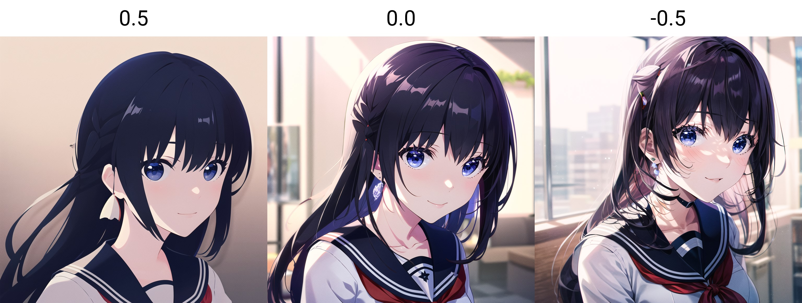
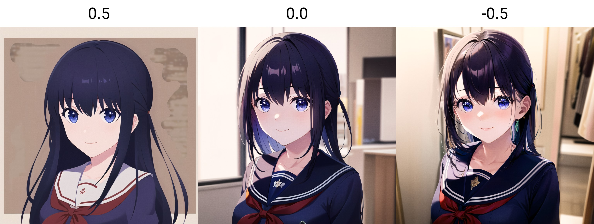

<h1 align="center">Tips & Tricks</h1>

<b>by. Haoming</b> <i>Last Update: 2023/05/24</i>

## Themes
You can write **CSS** scripts, or download ones made by others such as [Catppuccin](https://github.com/catppuccin/stable-diffusion-webui), 
and then save as `user.css` in the project directory to change how the webui looks.

## Default Values
Inside your webui installation folder, there is a file called `ui-config.json`

You can open it and edit the entries to change the default ui values, such as setting your desired `Sampling method` or increasing the max resolution limits.
Save you a few clicks everytime you use the webui.

## HDR
Some people found out that, the noise functions used during training was flawed, causing Stable Diffusion to always generate image with average brightness of `0.5`.
*(**ie.** Even if you prompt for dark/night or bright/snow, the overall image still looks "grey" on average)*

> [Technical Explanations](https://youtu.be/cVxQmbf3q7Q)

The solution is to use [Noise Offset](https://civitai.com/models/13941/epinoiseoffset), which allows you to generate some truly dark or bright images.

## Extra Details
**New:** Or just use [Detail Tweaker](https://civitai.com/models/58390/detail-tweaker-lora-lora) 💀

There is a LoRA called [Minimalist Anime Style](https://civitai.com/models/24833/minimalist-anime-style) on CivitAI, 
which when used can generate some simple stylistic results. 
But someone on Reddit found out that, when used with **negative** LoRA strength *(still in **positive** prompt)*,
it can instead generate incredibly detailed results.

**Note:** If you set the stregnth too extreme, the result may become distorted however.

### Example Images:
The following images feature [Mana](https://civitai.com/models/18659/nagase-mana-idoly-pride) in uniform, using the above LoRA with strength from `0.5` to `-0.5`

## Logo Creations
You can generate stylistic logos *(like those of eSports teams)* by following the steps below. *Original credit: [Reddit](https://www.reddit.com/r/StableDiffusion/comments/11i11nd/to_generate_icons_on_a_neutral_background_put_a/).*
1. Prepare a solid color image using any program
2. Upload it to **img2img** 
3. Set the **denoising strength** to `1.0`
4. Prompt the subject of choice
5. ...
6. ~~Profit~~

## *More Coming Soon*